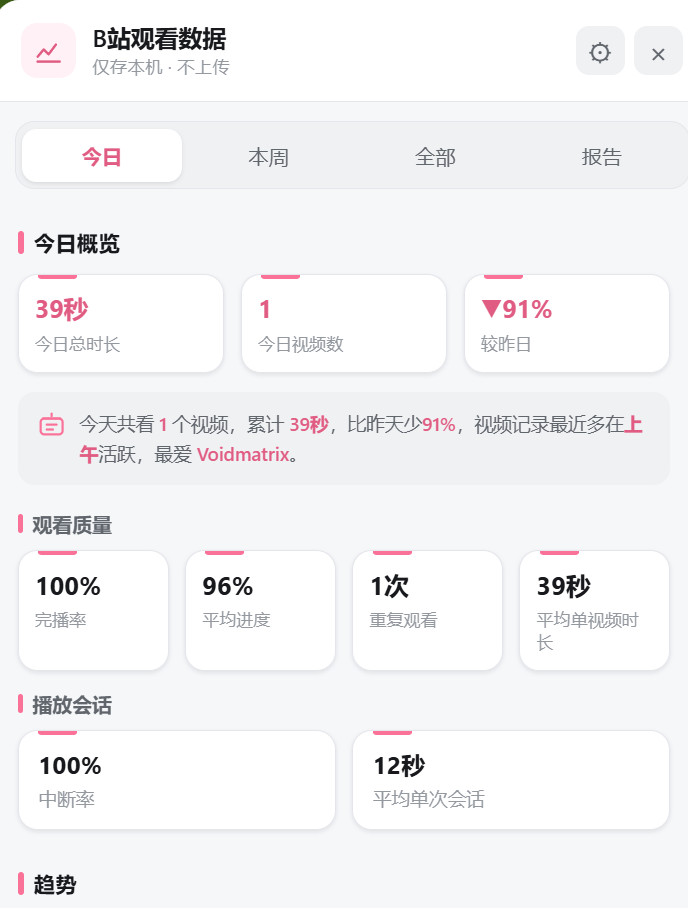
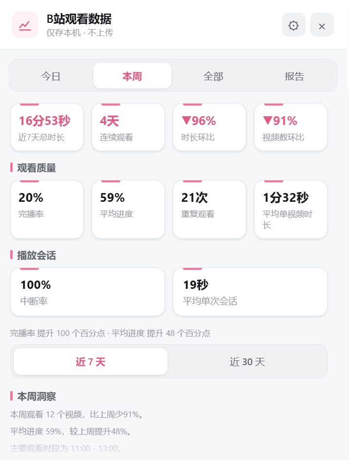
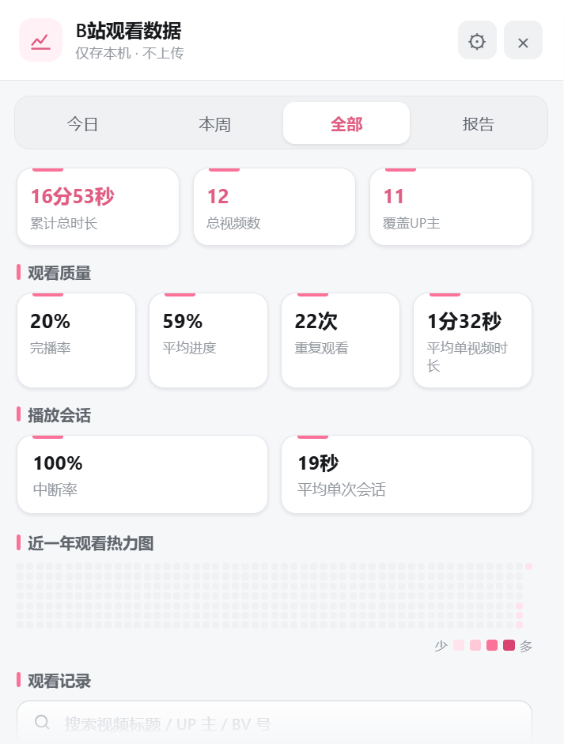
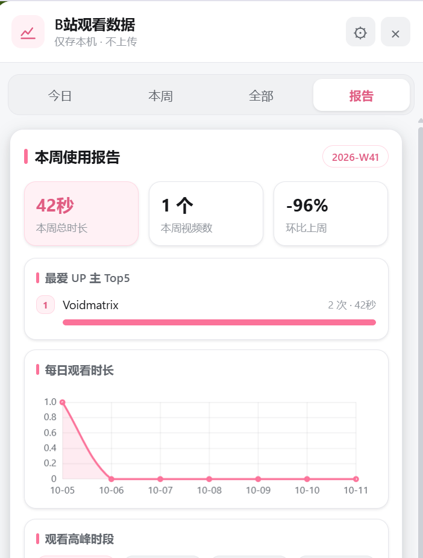

# Bilibili Watch Panel

<p align="center">
  <strong>本地优先的 B 站个人观看数据面板</strong><br>
  在不上传观看数据的前提下，记录观看行为、分析观看质量，并生成一份可读的本周使用报告。
</p>

<p align="center">
  <a href="https://github.com/Gavin-gwj/bilibili-watch-panel/releases/tag/v0.8.2"></a>
  
  
  
</p>

<p align="center">
  <a href="https://github.com/Gavin-gwj/bilibili-watch-panel/releases/tag/v0.8.2">下载 v0.8.2</a> ·
  <a href="./bilibili-watch-panel.user.js">查看用户脚本</a> ·
  <a href="./CHANGELOG.md">版本记录</a>
</p>

---

## v0.8.2 计时口径与性能修复

> 当前版本为 **0.8.2**，于 2026-10-04 发布。20 项逻辑测试、42 项隔离浏览器断言已通过；升级前建议先导出 JSON。

- 修复慢速播放（0.5x / 0.75x 等）观看时长被按视频进度少算的问题，时长现在按实际播放的墙钟秒数累计。
- 修复近 30 天范围下每日完播率、每日平均观看进度图表重复读取全部记录造成的卡顿。
- 不影响已有本地数据结构，无需迁移；升级后建议继续使用「导出 JSON」定期备份。

## v0.8.1 本周页控件视觉升级

> 发布于 2026-10-03。18 项逻辑测试、42 项隔离浏览器断言已通过。

- 本周页「近 7 天 / 近 30 天」改为分段切换控件，选中态更清晰。
- 本周页「每周目标」改为输入组与主操作按钮，提升层次、可读性与操作明确度。
- 保留原有功能、交互逻辑和本地数据结构，未新增依赖。

- 支持跟随系统、浅色、深色主题，面板宽度（320–520 px）与悬浮按钮尺寸（40/48/56 px）。
- 可重置悬浮按钮位置或恢复默认外观，不影响观看记录、周目标与提醒状态。
- 可关闭每周报告提醒，或启用 `Alt+Shift+W` 面板快捷键；`Esc` 按详情 → 设置 → 面板逐层退出。
- 提供只读数据健康检查：识别格式错误、无效记录、重复记录、非法数值、会话异常与历史裁剪提示，不自动修复。

## 这是什么？

Bilibili Watch Panel 是一个**纯本地运行的 Tampermonkey 用户脚本**。它把分散在 B 站观看过程中的信息，整理成一个轻量的侧边数据面板：

- 看了多久：今日、本周、全部累计时长
- 看了什么：视频数量、观看记录、近一年观看热力图
- 看谁的：UP 主排行、观看次数与时长占比
- 看得怎么样：完播率、平均进度、重复观看和有效观看时长
- 怎么变化：播放会话、中断率、每日趋势与本周报告

> 截图中的数据来自本机浏览器示例，仅用于展示界面；脚本不会读取或上传其他用户的数据。

## 从页面到面板

<p align="center">
  
</p>

在任意 B 站页面右侧，脚本提供一个可拖动的粉色浮动入口。点击后打开侧边面板；入口位置会在本地记忆，并在浏览器缩放或窗口尺寸变化后自动重新吸附到当前视口内。

## 界面一览

<table>
  <tr>
    <td width="50%" valign="top">
      <h3>今日 · 现在的观看状态</h3>
      
      <p>查看今日总时长、视频数、较昨日变化、观看质量和播放会话状态。</p>
    </td>
    <td width="50%" valign="top">
      <h3>本周 · 一周观看节奏</h3>
      
      <p>查看近 7 / 30 天趋势、连续观看天数、质量指标和本周洞察。</p>
    </td>
  </tr>
  <tr>
    <td width="50%" valign="top">
      <h3>全部 · 长期观看档案</h3>
      
      <p>查看累计数据、近一年热力图，并搜索或筛选完整观看记录。</p>
    </td>
    <td width="50%" valign="top">
      <h3>报告 · 一页式周报</h3>
      
      <p>把本周总览、最爱 UP 主和每日时长整理成适合保存的报告卡片。</p>
    </td>
  </tr>
</table>

## 程序设计自述

### 1. 本地优先：数据只在浏览器里流动

脚本采用 Tampermonkey 的本地存储能力保存观看记录，不建立账号、不上传数据、不设置服务端。数据流可以概括为：

```text
B站页面公开信息
        │
        ▼
视频事件采集 → 本地记录合并 → 统计口径计算 → Shadow DOM 面板渲染
                                      │
                                      ├─ JSON 导出 / 导入
                                      └─ 本周报告图片导出
```

脚本只在视频页处理播放进度；首页、动态页等其他页面可以打开面板查看数据，但不会因为页面上的内嵌视频而写入观看记录。

### 2. 以播放事件为核心，而不是用定时器猜测

观看时长来自 `video.currentTime` 的实际推进量：暂停、卡顿、切到后台和缓冲不会被伪装成有效观看时长。v0.7 起，每条记录还会保存已结束播放会话的：

- 开始时间与结束时间
- 会话内有效观看秒数
- 暂停次数、切后台次数和跳转次数
- 自然结束、暂停、离开页面等结束原因

这样做的好处是，统计结果能够区分“打开过视频”和“真正观看过视频”，并支持中断率、平均单次会话等质量指标。

### 3. Shadow DOM 隔离界面样式

面板挂载在独立的 Shadow DOM 中，颜色、圆角、阴影、间距和字体由设计令牌统一管理。这样既能保持 Bilibili Studio 风格的浅灰工作台视觉，也能减少 B 站页面自身 CSS 对面板的干扰。

面板由四个互补的视图组成：

| 视图 | 解决的问题 | 主要信息 |
| --- | --- | --- |
| 今日 | 我今天看了什么？ | 时长、视频数、质量、会话、趋势 |
| 本周 | 我这周的节奏如何？ | 近 7 / 30 天、连续观看、环比、洞察 |
| 全部 | 我的长期观看档案是什么？ | 累计统计、热力图、搜索、记录详情 |
| 报告 | 如何快速回顾这一周？ | 总览、Top5 UP 主、每日图表、总结 |

### 4. 面向长期使用的数据兼容策略

脚本使用 schema 版本管理本地数据。升级时会兼容已有旧记录，补齐缺失字段，但不会根据旧记录的累计秒数虚构历史完播或播放会话；JSON 导入则采用合并与去重策略，避免重复导入造成重复统计。

## 核心功能

### 观看数据

- 今日、本周、全部和报告四个 Tab
- 今日 / 本周 / 累计观看时长与视频数
- 完播率、平均进度、重复观看、平均单视频时长
- 播放会话数、会话中断率、平均单次有效观看时长
- UP 主排行、每日时长趋势、近一年观看热力图
- 观看记录搜索、排序、筛选和详情抽屉

### 数据管理

- **导出 JSON**：下载 `bwp-backup-YYYY-MM-DD.json` 本地备份
- **导入 JSON**：合并记录、补齐信息、去重播放会话
- **导出报告图片**：生成 `bwp-week-report-YYYY-Www.png`
- **清空数据**：双重确认，避免误操作
- **自动更新**：通过 `@updateURL` / `@downloadURL` 检查新版本

## 安装

1. 安装浏览器扩展 **篡改猴 / Tampermonkey**。
2. 打开 [`bilibili-watch-panel.user.js`](./bilibili-watch-panel.user.js)。
3. 点击右上角 **Raw**，Tampermonkey 会打开安装页。
4. 安装完成后打开任意 B 站页面，点击右侧粉色浮动按钮。
5. 在视频页播放视频后，面板会开始记录观看数据。

也可以直接从 [v0.8.2 Release](./bilibili-watch-panel.user.js) 下载脚本。

## 隐私与合规

- 只统计当前浏览器中本人的观看行为。
- 数据只存储在 Tampermonkey 的本地存储中。
- 不上传观看数据，不建立服务器账号体系。
- 不批量爬取，不破解或绕过会员、付费机制。
- 只读取页面已经公开加载的信息，不干扰 B 站正常功能与计费体系。
- 除页面信息缺失时的一次性视频信息 API 兜底请求外，不额外发送批量请求；兜底结果会在本地缓存 7 天。

> 卸载脚本或清除浏览器扩展数据后，本地记录会消失。建议定期使用「导出 JSON」备份。

## 常见问题

| 问题 | 回答 |
| --- | --- |
| 数据存在哪里？ | 只在本机浏览器的 Tampermonkey 扩展存储中，仓库和服务器都收不到。 |
| 为什么时长比实际看的少？ | 脚本只统计 `video.currentTime` 的真实推进；暂停、卡顿、缓冲和切后台不计入。 |
| 如何迁移到新设备？ | 在旧设备导出 JSON，在新设备安装脚本后使用「导入 JSON」合并。 |
| B 站改版后没有数据怎么办？ | 页面选择器集中在脚本的 `SELECTORS` 常量区，可针对改版更新选择器。 |
| 浏览器缩放后按钮不见了怎么办？ | v0.7.1 已加入视口重定位逻辑；刷新页面后按钮会自动回到当前可视区域。 |

## 版本

- **v0.8.2**：修复慢速播放时长少算与近 30 天图表重复读取记录的问题。
- **v0.8.1**：优化本周页时间范围与每周目标控件，补充分组与输入语义。
- **v0.8.0**：新增设置视图、主题、健康检查与快捷键等体验增强。
- **v0.7.1**：修复浏览器缩放后浮动按钮可能超出视口的问题，并在窗口尺寸变化时自动重新定位。
- **v0.7.0**：加入播放会话、会话中断率和详情抽屉。
- 完整历史见 [`CHANGELOG.md`](./CHANGELOG.md)。

## License

MIT
